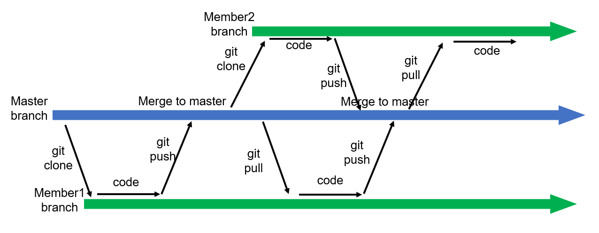
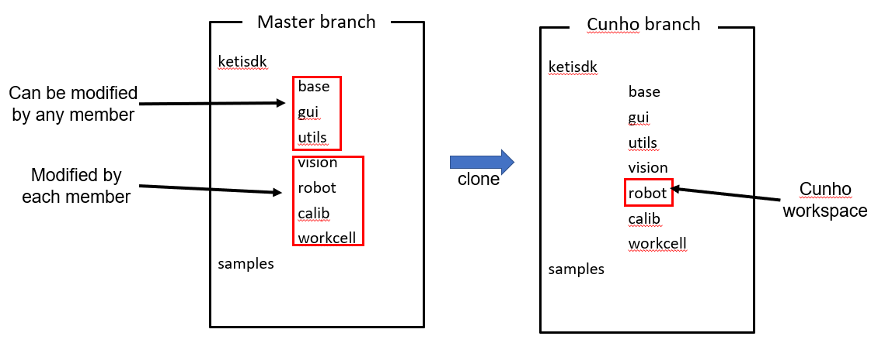

[Main](../README.md)

## Keti SDK repository [Link](https://github.com/keti-ai/ketisdk)

- A repository  includes **1 default master** branch and other **members’ branches**
- Master branch should be **deployable**, mean that it can be used by **all users**
- An member’s branch are **specified**, mean that it is for only one user



## *** Important: 
- Do not **git push to MASTER BRANCH**, master branch is ONLY used to MERGE all codes from member
- Do not **DELETE .git folder**, .git include all change history. If deleted, branch cannot merge to master
- If .git accidently deleted, you can do **git rebase** (not sure), or you can copy .git from master branch to your working folder



- To avoid  conflit, users work on **different folders** with each others. 
- If working in same folder, make sure working **file names are differents**.
- After user complete branch development, user's branch will be **checked overlaping** with master and then **merged** to master

## For each member:
### 1. Clone code from master brach 
- For first time only
```sh
git clone $REPOSITORY_LINK
```
### 2. Resume your work
- Set github link
```sh
git remote add $REPOSITORY_LINK
```
- Uupdate changes from master branch
```sh
git pull origin master
```
### 3. Work on **your recomended workspace**. 
- If you work on other folders, make sure your filename are **distinguished** to other member.

### 4. Push your temporaly complete work to git.  Recommend to push code every working day in order to backup codes.
- Set github link
```sh
git remote add $REPOSITORY_LINK
```
- Set member's branch
  + If branch not exist
  ```sh
  git checkout -b $MEMBER_BRANCH
  ```
  + If branch exist
  ```sh
  git chekcout $MEMBER_BRANCH
  ```
- Add code location to be pushed
  + If add a folder
  ```sh
  git add $DIR_PATH
  ```
  + If add current folder
  ```sh
  git add .
  ```
  + If add current folder with some ignorances
  ```sh
  git add . .gitignore
  ```
  **.gitignore** includes all filepaths which will not be push. It is helpful to neglect heavy data or checkpoints, for example data/\*, checkpoint/\*
- Edit commit message
```sh
git commit -m $MSG
```
**Commit message** descrbing who changed and what changed, e.x. [Cunho] Add HRC movej
- Push code to your brach
```sh
git push origin $MEMBER_BRANCH
```

[Main](../README.md)


