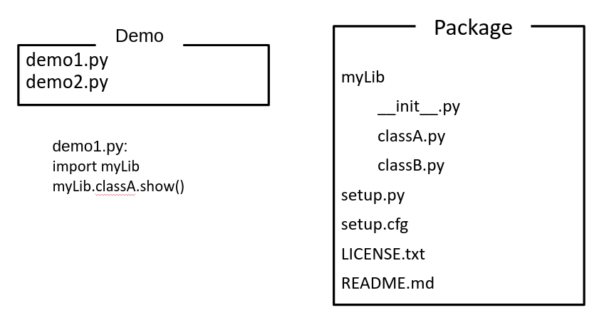

[Main](../README.md)

- Your code placed on **2 separate folders**: 1 for package, 1 for demo

- Package is install **in develop mode**. Hence, it can be modified from other projects

- Share package folder only for co-developer.

[Main](../README.md)

