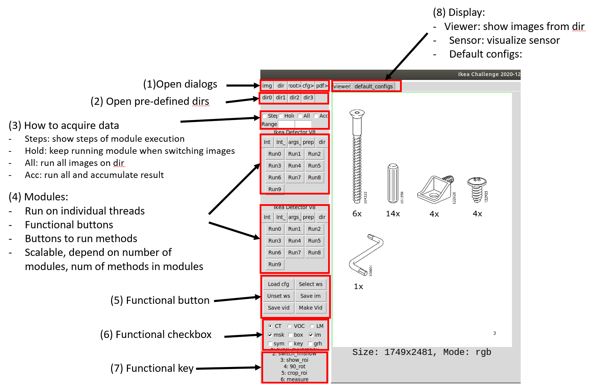

[Main](../README.md)

## Tkinter


## Gui Module Wrapper


## Samples
1. Define a module
```sh
from ttcv.basic.basic_objects import BasObj
class ImProcessModule(BasObj):
    def rot90(self, im):
        return cv2.rotate(im, cv2.ROTATE_90_CLOCKWISE)

    def toGray(self, im):
        if len(im.shape)>2: return cv2.cvtColor(im,cv2.COLOR_BGR2GRAY)
        else: return im
```
2. Wrap it into GUI module
```sh
from ttcv.basic.basic_objects import DetGui
from ttcv.basic.basic_gui import GuiModule

class ImProcessGui(ImProcessModule,DetGui):
    def gui_process_single(self, rgbd, method_ind=0, filename='unnamed', disp_mode='rgb'):
        if method_ind==0: return self.rot90(im)
        if method_ind==1: return  self.toGray(im)
        
module = GuiModule(module=ImProcessModule,type='im_process', name='Image Process',
                   category='detector', num_method=2, run_thread=True)
```
3. Run GUI with defined module
```sh
BasGUI(title='Image Processing Demo', modules=[module,], test_dirs=['data',])
```


[Main](../README.md)
